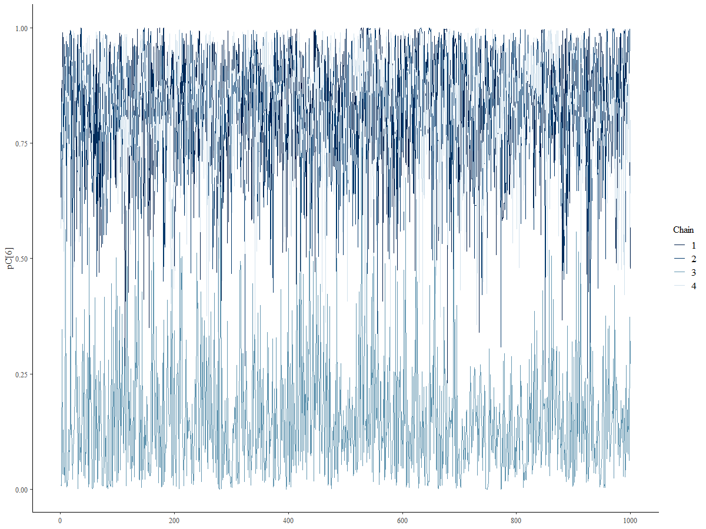
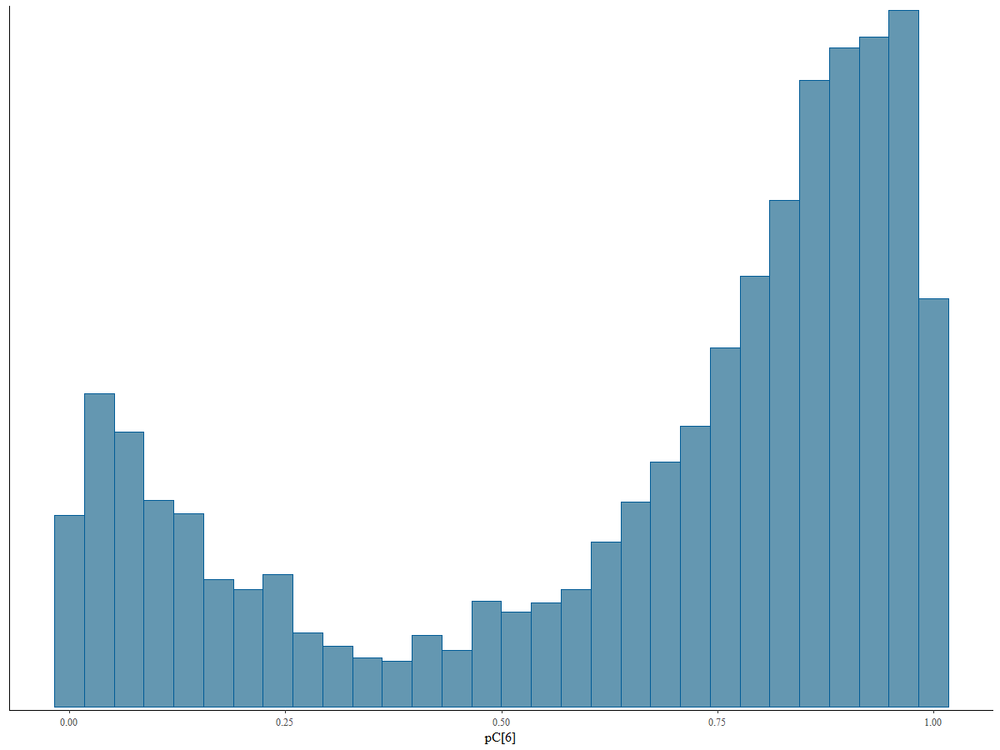
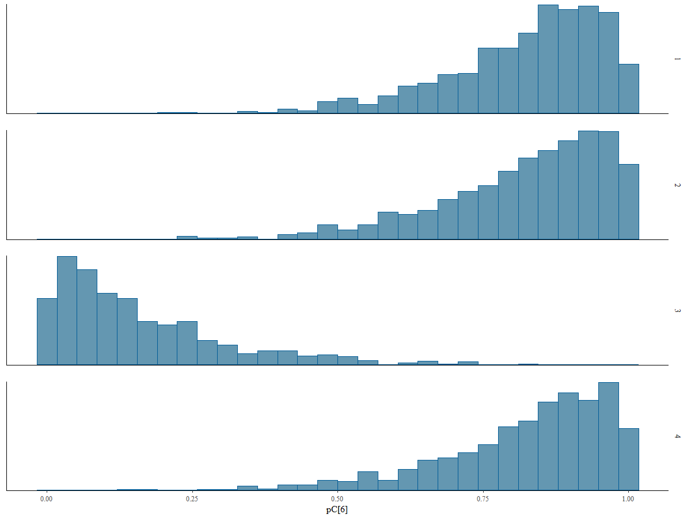

```{r klippy, echo=FALSE, include=TRUE}
klippy::klippy(position=c('top','right'),color='#33C1FF')
```


<style>
.list-group-item.active, .list-group-item.active:focus, .list-group-item.active:hover {
    z-index: 2;
    color: #fff;
    background-color: #33C1FF;
    border-color: #97CAEF;
}

</style>


```{r setup, include=FALSE}
knitr::opts_chunk$set(comment = "",fig.align='center',message = FALSE,warning = FALSE)
require(here)
require(ggplot2)
require(plot3D)
require(kableExtra)
require(knitr)
require(giski)
require(magick)

options(scipen=99)

```

`r paste('[Updated:',format(Sys.time(),'%a, %b %d, %Y - %H:%M:%S'),']')`

<font color="black">

```{r, eval=TRUE,echo=FALSE}
require(rstan)

load(here("do_not_upload/model_fit.RData"))

r.long <- d_long
r <- d_wide
```

# Acknowledgement

This tutorial is a product of a research project funded by Duolingo, Inc. through Competitive Research Grant Program to support topics of interest related to Duolingo's English Test's ongoing research agenda.

# Introduction

This tutorial provides a detailed introduction to an enhanced version of the model initially introduced by [Shu et al. (2023)](https://doi.org/10.1007/s11336-012-9311-3). The original model assumed that the compromised status of items was known beforehand. It focused on estimating whether an examinee had item preknowledge, given a predefined vector indicating the compromise status of items using response accuracy. Follow up studies such as [Eckerly (2016)](https://uoregon.idm.oclc.org/login?url=https://www.proquest.com/dissertations-theses/increasing-robustness-deterministic-gated-irt/docview/1817649033/se-2?accountid=14698) showed that the performance the model drops when the vector of item compromise status is misspecified.

In the enhanced version presented here, the requirement for prior knowledge of item compromise status is removed. Instead, both examinee status and item compromise status are treated as unknown parameters to be estimated simultaneously. This upgraded model outputs two probabilities in a single analysis: the probability that an examinee has item preknowledge and the probability that an item is compromised.

# Model Description

This section describes the model fitted to the response accuracy data using the following notations:

- Items are indexed by $i = 1,...,I$,

- Examinees are indexed by $j = 1,...,J$

- For the $j^{th}$ examinee, $\mathbf{R}_j = (\mathrm{R}_{j1}, \ldots, \mathrm{R}_{jI})$ represents a vector of dichotomous item responses for $I$ items, with realizations $\mathbf{r}_j = (\mathrm{r}_{j1}, \ldots, \mathrm{r}_{jI})$. 

- For the $i^{th}$ item, item difficulty parameter is denoted as $b_i \in \mathbb{R}$.

The proposed model defines two latent trait parameters for each examinee:

- $\theta_{tj} \in \mathbb{R}$: The true latent trait when the $j^{th}$ examinee responds to an item without prior knowledge.

- $\theta_{cj} \in \mathbb{R}$: The cheating latent trait when the examinee responds to an item with prior knowledge.

Additionally, we define:

- A binary parameter for each examinee to indicate item preknowledge status, $H_j$, where $H_j = 0$ means the examinee is honest and does not have item preknowledge, and $H_j = 1$ means the examinee is dishonest and has item preknowledge.

- A binary parameter for each item to indicate compromise status, $C_i$, where $C_i = 0$ means the item is not compromised, and $C_i = 1$ means the item is compromised.

An observed binary response (1 for correct, 0 for incorrect) of the $j^{th}$ examinee on the $i^{th}$ item is assumed to follow the distribution:

$$R_{ij} \sim f(r_{ij}; \theta_{tj}, \theta_{cj}, H_j, b_i, C_i).$$
Here, $f(r_{ij}; \theta_{tj}, \theta_{cj}, H_j, b_i, C_i)$ denotes a Bernoulli probability function with a success parameter:

$$P(r_{ij} = 1 \mid \theta_{tj}, \theta_{cj}, H_j, b_i, C_i) = \frac{1}{1 + e^{b_i - \theta_j}},$$

where $\theta_j$ is defined as:

$$\theta_j = 
\begin{cases} 
\theta_{cj}, & \text{if } H_j = 1 \text{ and } C_i = 1, \\ 
\theta_{tj}, & \text{otherwise}. 
\end{cases}$$

Since Stan does not directly handle discrete parameters, marginalization of $H_j$ and $C_i$ is required. This involves summing over the four possible combinations of $H_j$ and $C_i$:

- $H_j = 0, C_i = 0$: Honest examinee responds to an uncompromised item.
- $H_j = 1, C_i = 0$: Dishonest examinee responds to an uncompromised item.
- $H_j = 0, C_i = 1$: Honest examinee responds to a compromised item.
- $H_j = 1, C_i = 1$: Dishonest examinee responds to a compromised item.

The probability density can be expressed as:

$$f(r_{ij}; \theta_{tj}, \theta_{cj}, H_j, b_i, C_i) = \sum_{H_j, C_i} f(r_{ij}; \theta_{tj}, \theta_{cj}, H_j, b_i, C_i) \cdot P(H_j) \cdot P(C_i).$$

The model assumes that $\theta_{cj} > \theta_{tj}$ for any examinee, ensuring proper chain convergence and reducing the chance of label switching. The item difficulty parameters are scaled such that their sum equals zero.

Latent trait parameters are modeled as a multivariate normal distribution:

$$\begin{pmatrix} \theta_{tj},\theta_{cj} \end{pmatrix} \sim N(\mu_{\theta}, \Sigma_{\theta}),$$

where $\Sigma_{\theta}$ is decomposed into standard deviations and a correlation matrix:

$$\Sigma_{\theta} = 
\begin{pmatrix} 
\sigma_{\theta_t} & 0 \\ 
0 & \sigma_{\theta_c} \end{pmatrix} 
\Omega_{\theta} 
\begin{pmatrix} \sigma_{\theta_t} & 0 \\
0 & \sigma_{\theta_c} \end{pmatrix},$$

$$
\Omega_{\theta} =
\begin{pmatrix} 
1 & \rho_{\theta_t,\theta_c} \\ 
\rho_{\theta_t,\theta_c}  & 1 \end{pmatrix}.
$$

The priors distributions for the person parameters are specified as follows:

$$\mu_{\theta_t}, \mu_{\theta_c} \sim N(0, 1),$$

$$\sigma_{\theta_t}, \sigma_{\theta_c} \sim \text{Exponential}(1),$$

$$\Omega_{\theta} \sim \text{LKJ}(1).$$

The item difficulty parameters for (I - 1) items are assumed to follow a normal distribution.

$$\mathbf{b} \sim N(\mu_b,\sigma_b),$$
with $\mu_b$ is the mean and $\sigma_b$ is the standard deviation of item difficulty parameters for (I - 1) items,

$$\mu_b\sim N\left(0,1\right),$$

$$\sigma_b\sim exponential\left(1\right).$$

The value of the item difficulty for the remaining item is determined by computing the negative sum of the item difficulty parameters for (I - 1) items.

The prior for the probabilities of $P(H_j = 1)$ and $P(C_i = 1)$ are specified as:

$$
P(H_j = 1) \sim \text{Beta}(1, 1)
$$

$$
P(C_i = 1) \sim \text{Beta}(1, 1)
$$

# Stan Model Syntax

The data block defines the structure and input data required for the model. It assumes that the data is provided in a long format, which is particularly advantageous for handling missing responses in sparse datasets. In this format, the data has at least a column for subject IDs (e.g., examinee identifiers), a column for item IDs, and another column for observed dichotomous responses.

```{r, eval=FALSE,echo=TRUE}
data{
    int <lower=1> J;                       // number of examinees          
    int <lower=1> I;                       // number of items
    int <lower=1> n_obs;                   // number of observations (I xJ - missing responses)
    int <lower=1> p_loc[n_obs];            // person indicator   
    int <lower=1> i_loc[n_obs];            // item indicator
    int <lower=0,upper=1> Y[n_obs];       // vector of item responses  
}
```

The parameters and transformed parameters block specifies all the parameters required by the model. 

```{r, eval=FALSE,echo=TRUE}
parameters {
  real mu_thetat;             // mean for theta_t
  real<lower=0> sigma_thetat; // sd for theta_t
  
  real mu_thetac;             // mean for theta_c
  real<lower=0> sigma_thetac; // sd for theta_c

  corr_matrix[2] omega_P;    // 2 x 2 correlation matrix for person parameters
  
  vector<lower=0,upper=1>[I] pC; // vector of length I for the probability of item compromise status
  
  vector<lower=0,upper=1>[J] pH; // vector of length J for the probability of examinee item peknowledge 
  
  ordered[2] person[J];          // an array with length J for person specific latent parameters
                                 // Each array has two elements
                                 // first element is theta_t
                                 // second element is theta_c
                                 // ordered vector assures that theta_c > theta_t for every person
                                 // to make sure chains are exploring the same mode and 
                                 // multiple chains do not go east and west leading multi-modal posteriors
 
  real mu_b;                  // mean for item difficulty parameters
  real<lower=0> sigma_b;      // sd for item difficulty parameters
  vector[I-1] b_star;         // vector of item difficulty parameters

}
```


```{r, eval=FALSE,echo=TRUE}

transformed parameters{
  
  vector[2] mu_theta;         // vector for mean vector of person parameters 
    mu_theta[1] = mu_thetat;      // mu_thetat;                      
    mu_theta[2] = mu_thetac;      // mu_thetac;
 
  vector[2] scale_theta;          // vector of standard deviations for person parameters
   scale_theta[1] = sigma_thetat;               
   scale_theta[2] = sigma_thetac;
  
  cov_matrix[2] Sigma_theta;      // covariance matrix for person parameters
   Sigma_theta = quad_form_diag(omega_theta, scale_theta);
   
  vector[I] b;               // vector of item difficulty parameters for all I items
    b[2:I] = b_star;
    b[1]   = -sum(b_star);   // the first item is determined as the negative sum of Item 2 to Item I
                             // so the sum of item difficulty parameters are constrained to be 0
}
```

In the **parameters block**, I used `ordered[2] person[I]` to define the array for person-specific parameters instead of a simple `vector[2] person[I]`. The ordered type in Stan ensures that the elements of the vector are ordered, with the first element being smaller than the second. Specifically, in this case, it enforces that $\theta_c > \theta_t$ for every individual. 

This constraint may help in reducing the chance of multi-modal posterior distributions due to label switching (a common phenomena for models with mixture type). Without this enforced order, the model is more prone to multi-modal posterior distributions. This problem arise when different Markov Chain Monte Carlo (MCMC) chains explore different modes in opposite directions, leading to incoherent results and difficulties in interpretation. Below provides an example of this issue. We will also supplement this order constrain with an additional strategy to avoid label switching as much as possible.





Finally, we specify the prior distributions and model in the **model block**. 

```{r, eval=FALSE,echo=TRUE}
model{
  
  mu_thetat     ~ normal(0,1);
  sigma_thetat  ~ exponential(1);
  
  mu_thetac     ~ normal(0,1);
  sigma_thetac  ~ exponential(1);
  
  omega_theta   ~ lkj_corr(1);            

  person        ~ multi_normal(mu_P,Sigma_P);
  
  mu_b      ~ normal(0,1);
  sigma_b   ~ exponential(1);
  b_star    ~ normal(mu_b,sigma_b);
  
  pC ~ beta(1,1);
  pH ~ beta(1,1);
  
  for (i in 1:n_obs) {
    
      // b[i_loc[i]] represents b-parameter of the (i_loc[i])th item
      //person[p_loc[i],1] represents parameter theta_t of the (p_loc[i])th person
      //person[p_loc[i],2] represents parameter theta_c of the (p_loc[i])th person
      
      real p_t = person[p_loc[i],1] - b[i_loc[i]];  // non-cheating response
      real p_c = person[p_loc[i],2] - b[i_loc[i]];  // cheating response
      
      // log of probability densities for each combination of two discrete parameters
      // (C,H) = {(0,0),(0,1),(1,0),(1,1)}
      
      real lprt1 = log1m(pC[i_loc[i]]) + log1m(pH[p_loc[i]]) + bernoulli_logit_lpmf(Y[i] | p_t);  // H = 0, C=0
      real lprt2 = log1m(pC[i_loc[i]]) + log(pH[p_loc[i]])   + bernoulli_logit_lpmf(Y[i] | p_t);  // H = 1, C=0
      real lprt3 = log(pC[i_loc[i]])   + log1m(pH[p_loc[i]]) + bernoulli_logit_lpmf(Y[i] | p_t);  // H = 0, C=1
      real lprt4 = log(pC[i_loc[i]])   + log(pH[p_loc[i]])   + bernoulli_logit_lpmf(Y[i] | p_c);  // H = 1, C=1 
      target += log_sum_exp([lprt1, lprt2, lprt3, lprt4]);
  }
}
```

The whole Stan syntax for the model can be saved as a stan file ([Download the Stan model syntax](https://raw.githubusercontent.com/czopluoglu/duolingo_dgirt/refs/heads/main/script/dgirt.stan)).

# Data Generation

To test the model's performance, I will simulate a dataset based on the following specifications:

- 500 hypothetical examinees respond to 50 items.

- 50 examinees (10% of all examinees) have item preknowledge for 15 items (30% of items)

- The item difficulty parameters are drawn from a standard normal distribution.

- The true and cheating latent speed parameters $\theta_t$ and $\theta_c$ are drawn from a multivariate distribution with the following values:

$$\begin{pmatrix}
\theta_t \\ \theta_c
\end{pmatrix}
\sim
N(\mu_{\mathcal{\theta}}, \Sigma_{\mathcal{\theta}})$$

$$\mu_{\mathcal{P}} = 
\begin{pmatrix}
0 \\ 3
\end{pmatrix}$$

$$\Sigma_{\mathcal{P}} = 
\begin{pmatrix}
1 & 0.8 \\
0.8 & 1.25
\end{pmatrix}$$

The covariance matrix implies a correlation of 0.716 between $\theta_t$ and $\theta_c$. The code below generates observed dichotomous response accuracy data consistent with these specifications.

```{r, eval=FALSE,echo=TRUE}
require(MASS)
require(MBESS)
require(here)
require(psych)
require(pROC)
set.seed(7122024)
################################################################################
# Generate model parameters

N  <- 500     # sample size
n  <- 50      # number of items
pe <- 0.10    # proportion of examinees with item preknowledge
pi <- 0.30    # proportion of compromised items

# Generate the binary status of examinee item preknowledge
  # 1: examinee has item preknowledge
  # 0: examinee has item preknowledge

  tmp <- runif(N,0,1)
  H  <- ifelse(tmp<=quantile(tmp,pe),1,0)
  H
  table(H)

# Generate the binary status of item compromise
  # 1: item is compromised
  # 0: item is not compromised
  
  tmp <- runif(n,0,1)
  C  <- ifelse(tmp<=quantile(tmp,pi),1,0)
  C
  table(C)

# Generate item difficulty parameters
  
  b <- rnorm(n,0,1)
  b <- (b-mean(b))/sd(b)
  b
  describe(b)

# Generate person parameters
  
  mu_t    <- 0      # mean of true latent trait parameters
  mu_c    <- 3      # mean of cheating latent trait parameters
  sigma_t <- 1      # standard dev. of true latent trait parameters
  sigma_c <- 1.25   # standard dev. of cheating latent trait parameters
  cov_    <- 0.8    # covariance between cheating and true latent trait parameters

        1/(1+exp(-mu_t)) # probability of correct for average item without preknowledge
        1/(1+exp(-mu_c)) # probability of correct for average item with preknowledge
          
        # some rough idea about effect size, item preknowledge effect
        # Odds ratio
          exp(mu_c)/exp(mu_t)
          
      
  th <- mvrnorm(N,
                mu = c(mu_t,mu_c),
                Sigma = matrix(c(sigma_t,cov_,cov_,sigma_c),2,2))
      
  theta_t <- th[,1] 
  theta_c <- th[,2]
      
  describe(theta_t)
  describe(theta_c)
  describe(theta_c - theta_t)
  cor(theta_t,theta_c)
      
###############################################################################
# Generate observed responses

r <- matrix(nrow=N,ncol=n)

for(j in 1:N){
  for(i in 1:n){
    
    p_t <- exp(theta_t[j] - b[i])/(1+exp(theta_t[j] - b[i]))
    p_c <- exp(theta_c[j] - b[i])/(1+exp(theta_c[j] - b[i]))
    
    if(H[j] == 1 & C[i] == 1){
      r[j,i] = rbinom(1,1,p_c)
    } else {
      r[j,i] = rbinom(1,1,p_t)
    }
    
  }
}

colnames(r) <- paste0("Y",1:n)
###############################################################################

# Convert it to data frame and add group membership and a unique ID

d       <- as.data.frame(r)
d$group <- H
d$id    <- 1:nrow(d)

# Check the data

head(d)

# Reshape it to long format

d.long <- reshape(data        = d,
                  idvar       = 'id',
                  varying     = list(colnames(r)[1:n]),
                  timevar     = "Item",
                  times       = 1:n,
                  v.names     = c("R"),
                  direction   = "long")

d.long <- d.long[!is.na(d.long$R),]

# Add item status

d.long$compromised <- NA

for(i in 1:n){
  
  d.long[d.long$Item==i,]$compromised = C[i]
  
}


d.long <- d.long[order(d.long$Item),]

describeBy(d.long$R,list(d.long$group,d.long$compromised),mat=TRUE)

################################################################################

write.csv(d.long,'./data/simdata_long.csv',
          row.names = FALSE)  

write.csv(d,'./data/simdata_wide.csv',
          row.names = FALSE)  

```

## Checking the simulated dataset

The table below shows the proportion of correct responses for hypothetical examinees in the simulated dataset, grouped by whether they had prior knowledge of the items, for both compromised and uncompromised items. As expected, the proportion of correct responses is similar for both groups on uncompromised items. However, examinees with prior knowledge respond more accurately on compromised items.

```{r, eval=TRUE,echo=FALSE}
require(dplyr)
require(DT)

# Create and format the summary table
summary_table <- r.long %>%
  group_by(compromised, Item) %>%
  summarise(
    Honest_Mean = round(mean(R[group == 0], na.rm = TRUE), 2),
    Dishonest_Mean = round(mean(R[group == 1], na.rm = TRUE), 2),
  ) %>%
  ungroup() %>%
  mutate(
    Compromised_Status = ifelse(compromised == 1, "Compromised", "Uncompromised")
  ) %>%
  select(Compromised_Status, Item, Honest_Mean, Dishonest_Mean)

# Display the interactive table
datatable(
  summary_table,
  options = list(
    pageLength = 50,
    autoWidth = TRUE,
    order = list(list(0, 'asc')) # Sort by Compromised_Status
  ),
  colnames = c(
    "Compromised Status", "Item Number", 
    "Honest Group Mean","Dishonest Group Mean"
  ),
  rownames = FALSE,
  caption = "Proportion of Correct Response by Group"
)

```

# Fitting the model

The first step is to structure the input data in a list format. This is required because Stan accepts data in a specific format for model fitting. Each element in the list corresponds to a variable used in the Stan model.

```{r, eval=FALSE,echo=TRUE}
data_resp <- list(
  I              = length(unique(d_long$Item)),
  J              = length(unique(d_long$id)),
  n_obs          = nrow(d_long),
  p_loc          = d_long$id,
  i_loc          = d_long$Item,
  Y              = d_long$R
)
```

Before fitting the model, the Stan syntax (.stan file) needs to be compiled into a format that can be executed. This step creates a cmdstan_model object.

```{r, eval=FALSE,echo=TRUE}
# Compile the model syntax
mod <- cmdstan_model('./script/dgirt.stan')
```

## Single chain initialization

In addition to the order constraints ($\tau_c > \tau_t$), discussed earlier, I am also employing a single chain initialization strategy as a complementary approach to further mitigate the risk of label switching. By initializing the parameters near plausible values within the vicinity of a single mode, this method helps stabilize the sampling process and reduces the likelihood of components switching labels during inference. While the order constraint enforces a structural restriction to break the symmetry of the mixture components, single chain initialization adds an extra layer of robustness by anchoring the chains to a specific mode early in the sampling process. Together, these strategies work in tandem to address the challenges posed by label switching, ensuring more reliable and interpretable posterior inferences. For more information, see [this link](https://mc-stan.org/docs/stan-users-guide/problematic-posteriors.html#hacks-as-fixes).

The code below fits the model using a single chain and relatively fewer iterations. 

```{r, eval=FALSE,echo=TRUE}
fit_init <- mod$sample(
  data            = data_resp,
  seed            = 1234,
  chains          = 1,
  iter_warmup     = 150,
  iter_sampling   = 150,
  refresh         = 10,
  adapt_delta     = 0.99)

stanfit_init <- rstan::read_stan_csv(fit_init$output_files())
```

Once we fit the model with a single chain, we extract the model parameters and we will feed these values as starting parameters in the next stage.


## Multi-chain estimation

The next step is to fit the model using multiple chains and more iterations. The code below first creates a list object for starting parameters based on the output from a single chain estimation. Then, we feed these values as starting values to each chain. We are fitting the model with four chains, and each chain has 1000 warmup iterations followed by 1000 sampling iterations.

```{r, eval=FALSE,echo=TRUE}
# a vector of initial item difficulty parameters

b_start <- as.vector(summary(stanfit_init, 
                             pars = c("b"), 
                             probs = c(0.025, 0.975))$summary[,1])

# a two column matrix of initial theta parameters

theta <- data.frame(thetat = summary(stanfit_init, 
                                     pars = c("person"), 
                                     probs = c(0.025, 0.975))$summary[seq(1,N*2,2),1],
                    thetac = summary(stanfit_init, 
                                     pars = c("person"), 
                                     probs = c(0.025, 0.975))$summary[seq(2,N*2,2),1])
rownames(theta) <- NULL
colnames(theta) <- NULL

# A vector of initial P(H=1) parameters, probability of an examinee having item preknowledge

H <- as.numeric(summary(stanfit_init, 
                        pars = c("pH"), 
                        probs = c(0.025, 0.975))$summary[,1])

# A vector of initial P(C=1) parameters, probability of an item being compromised

C <- as.numeric(summary(stanfit_init, 
                        pars = c("pC"), 
                        probs = c(0.025, 0.975))$summary[,1])

# Put the initial estimates together as a list

start <- list(b      = b_start,
              person = theta,
              pH     = H,
              pC     = C)

```

```{r, eval=FALSE,echo=TRUE}

fit <- mod$sample(
  data            = data_resp,
  seed            = 1234,
  chains          = 4,
  parallel_chains = 4,
  iter_warmup     = 500,
  iter_sampling   = 1000,
  refresh         = 10,
  init            = list(start,start,start,start),
  adapt_delta     = 0.99)

stanfit <- rstan::read_stan_csv(fit$output_files())
```

# Model Convergence

Ensuring model convergence is essential to verify the reliability of posterior estimates. This section outlines the evaluation of convergence diagnostics for different types of parameters in the model. The analysis follows the robust workflow detailed in Michael Betancourt's [Robust Statistical Worflow with RStan](https://betanalpha.github.io/assets/case_studies/rstan_workflow.html).

```{r, eval=TRUE,echo=TRUE}
# Extract model summary with 95% credible intervals
model_summary <- as.data.frame(
  summary(stanfit, probs = c(0.025, 0.975))$summary
)

# Add a column for parameter types extracted from row names
model_summary$type <- gsub("\\[.*$", "", row.names(model_summary))

# Filter for person and item parameters of interest
model_summary <- model_summary[model_summary$type%in%c('pC','pH','person','b'),]

head(model_summary)
```

- The `summary()` function extracts posterior summaries from the fitted model. These include point estimates (e.g., mean) and 95% credible intervals.

- The `gsub()` function removes index annotations (e.g., [1], [2,1]) from parameter names to group parameters by type.

- The `type` column is used to filter the summary data for specific categories (`pC`, `pH`, `person`, and `b`).

The `model_summary` can be used for further diagnostics

## Effective Sample Sizes

The minimum size of **effective samples per iteration** is 0.099 for item difficulty parameter estimates, 0.162 for person parameter estimates, 0.203 for probability of item compromise (pC), and 0.444 for probability of having item preknowledge(pH). They are all far above the threshold 0.001, indicating no problem in terms of estimating the effective sample sizes.

```{r, eval=TRUE,echo=TRUE}
N    <- dim(model_summary)[[1]]
iter <- dim(extract(stanfit)[[1]])[[1]]

model_summary$n_eff_ratio <- ratio <- model_summary[,'n_eff'] / iter

psych::describeBy(model_summary$n_eff_ratio,
                  model_summary$type,
                  mat=TRUE)[,c('group1','min')]

```

The summary of effective sample sizes by each parameter type is below.

```{r, eval=TRUE,echo=TRUE}
psych::describeBy(model_summary$n_eff,
                  model_summary$type,
                  mat=TRUE)[,c('group1','mean','min','max')]
``` 

```{r, eval=TRUE,echo=TRUE}
# Create a histogram of ESS values grouped by parameter type
ggplot(model_summary, aes(x = n_eff)) +
  geom_histogram(fill = "blue", color = "black", alpha = 0.7) +
  facet_wrap(~type, scales = "free_y",nrow=2) +
  labs(
    title = "Distribution of ESS Values by Parameter Type",
    x = "ESS",
    y = "Frequency"
  ) +
  theme_minimal()
```

## Split Rhat summary by Parameter type

All parameters exhibit excellent convergence with R-hat values less than 1.01. The highest R-hat value observed is 1.0076.

```{r, eval=TRUE,echo=TRUE}
# Create a histogram of Rhat values grouped by parameter type
ggplot(model_summary, aes(x = Rhat)) +
  geom_histogram(binwidth = 0.002, fill = "blue", color = "black", alpha = 0.7) +
  facet_wrap(~type, scales = "free_y",nrow=2) +
  labs(
    title = "Distribution of R-hat Values by Parameter Type",
    x = "R-hat",
    y = "Frequency"
  ) +
  theme_minimal()

psych::describeBy(model_summary$Rhat,
                  model_summary$type,
                  mat=TRUE)[,c('group1','mean','min','max')]

sum(model_summary$Rhat<1.01)/nrow(model_summary)
```

## Tree Depth

The results of the tree depth analysis indicate that none of the 4,000 post-warmup iterations saturated the maximum tree depth of 10 (0%). The majority of iterations achieved a tree depth of 7 (87.90%), with a smaller number reaching a tree depth of 8 (12.1%). This suggests that the sampler operated efficiently and did not encounter issues related to trajectory length limits during the model fit. No further adjustment to the max_treedepth parameter is necessary.

```{r, eval=TRUE,echo=TRUE}
max_depth = 10
sampler_params <- get_sampler_params(stanfit, inc_warmup=FALSE)
treedepths <- do.call(rbind, sampler_params)[,'treedepth__']
table(treedepths)
n = length(treedepths[sapply(treedepths, function(x) x == max_depth)])
N = length(treedepths)
100 * n / N
```

## E-BFMI

E-BMFI values were above 0.2 for all chains, the recommended threshold to flag inefficient exploration of the parameter space. There was no red flag in terms of potential inefficiencies in the exploration of the parameter space across the chains. Specifically:

- Chain 1: E-BFMI = 0.2471 
- Chain 2: E-BFMI = 0.3689 
- Chain 3: E-BFMI = 0.3997 
- Chain 4: E-BFMI = 0.3593 

```{r, eval=TRUE,echo=TRUE}
sampler_params <- get_sampler_params(stanfit, inc_warmup=FALSE)
e_bfmi <- c()
for (n in 1:length(sampler_params)) {
  energies = sampler_params[n][[1]][,'energy__']
  numer = sum(diff(energies)**2) / length(energies)
  denom = var(energies)
  e_bfmi[n] = numer / denom
  print(sprintf('Chain %s: E-BFMI = %s', n, numer / denom))
}
```

## Divergences

The divergence diagnostic for this model fit indicates no divergent transitions out of the total iterations (0%). This result suggests that the Hamiltonian Monte Carlo sampler explored the posterior distribution effectively, encountering no problematic regions or pathological neighborhoods.

```{r, eval=TRUE,echo=TRUE}
sampler_params <- get_sampler_params(stanfit, inc_warmup=FALSE)
divergent <- do.call(rbind, sampler_params)[,'divergent__']
n = sum(divergent)
N = length(divergent)
100 * (n / N)
```

# Parameter Estimates

## Person Parameter Estimates

The true latent trait parameter estimates ($\theta_t$) have a mean of -0.44 and a standard deviation of 0.96. In contrast, the cheating latent trait parameter estimates ($\theta_c$) exhibit a higher mean of 2.55 with a standard deviation of 0.82. 

```{r, eval=TRUE,echo=TRUE}
theta <- summary(stanfit, pars = c("person"), probs = c(0.025, 0.975))$summary
theta <- matrix(theta[,1],ncol=2,byrow=TRUE)
psych::describe(theta)
```

```{r, eval=TRUE,echo=FALSE}
tab <- round(summary(stanfit, pars = c("person"), probs = c(0.025, 0.975))$summary[,-2],2)
tab <- tab[seq(1,1000,2),]
datatable(
  tab,
  options = list(
    pageLength = 10,
    autoWidth = FALSE),
  colnames = c(
    "Posterior Mean", "Posterior SD", "2.5%","9.75%","ESS","Rhat"
  ),
  caption = "True Latent Trait Parameter Estimates"
)%>%
  formatStyle(
    columns = 1:ncol(tab),   # Select all columns to style
    `vertical-align` = "middle", # Center vertically
    `text-align` = "center"  # Center horizontally
  ) %>%
    formatRound(
    columns = c(1,2,3,4,6), # Format all numeric columns except ESS (column 6)
    digits = 2                  # Round to two decimals
  ) %>%
  formatRound(
    columns = 5,               # Format ESS column
    digits = 0                 # Round to no decimals
  )
```

```{r, eval=TRUE,echo=FALSE}
tab <- round(summary(stanfit, pars = c("person"), probs = c(0.025, 0.975))$summary[,-2],2)
tab <- tab[seq(2,1000,2),]
datatable(
  tab,
  options = list(
    pageLength = 10,
    autoWidth = FALSE),
  colnames = c(
    "Posterior Mean", "Posterior SD", "2.5%","9.75%","ESS","Rhat"
  ),
  caption = "Cheating Latent Trait Parameter Estimates"
)%>%
  formatStyle(
    columns = 1:ncol(tab),   # Select all columns to style
    `vertical-align` = "middle", # Center vertically
    `text-align` = "center"  # Center horizontally
  ) %>%
  formatRound(
    columns = c(1,2,3,4,6), # Format all numeric columns except ESS (column 6)
    digits = 2                  # Round to two decimals
  ) %>%
  formatRound(
    columns = 5,               # Format ESS column
    digits = 0                 # Round to no decimals
  )
```

## Item Parameters

The item difficulty parameter estimates, $b$, has a mean of 0 with a standard deviation of 1.12.

```{r, eval=TRUE,echo=TRUE}
  b <- summary(stanfit, pars = c("b"), probs = c(0.025, 0.975))$summary
  psych::describe(b[,1])
```


```{r, eval=TRUE,echo=FALSE}
tab <- round(summary(stanfit, pars = c("b"), probs = c(0.025, 0.975))$summary[,-2],2)
datatable(
  tab,
  options = list(
    pageLength = 10,
    autoWidth = FALSE),
  colnames = c(
    "Posterior Mean", "Posterior SD", "2.5%","9.75%","ESS","Rhat"
  ),
  caption = "Item Difficulty Parameter Estimates"
)%>%
  formatStyle(
    columns = 1:ncol(tab),   # Select all columns to style
    `vertical-align` = "middle", # Center vertically
    `text-align` = "center"  # Center horizontally
  ) %>%
    formatRound(
    columns = c(1,2,3,4,6), # Format all numeric columns except ESS (column 6)
    digits = 2                  # Round to two decimals
  ) %>%
  formatRound(
    columns = 5,               # Format ESS column
    digits = 0                 # Round to no decimals
  )
```

## Interpreting P(C=1) and evaluating predictive performance in detecting compromised items

Two groups of items were clearly separated by the probability estimates of being compromised. The probabilities ranged from 0.05 to 0.83 with a mean of 0.27 and standard deviation of 0.16 for uncompromised items (group1 = 0), and ranged from 0.66 to 0.93 with a mean of 0.86 and standard deviation of 0.085 for compromised items (group1 = 1).

```{r, eval=TRUE,echo=TRUE}
# Retrive the true item compromise status
# from long format data

C_vec <- c()

for(kk in 1:50){
  C_vec[kk] = unique(d_long[d_long$Item==kk,]$compromised)
}


pC <- as.numeric(summary(stanfit, pars = c("pC"), probs = c(0.025, 0.975))$summary[,1])

psych::describeBy(pC,C_vec,mat=TRUE)[,c('group1','n','mean','sd','min','max')]

plot(density(pC[C_vec==0]),xlim=c(0,1),main="",ylim = c(0,8))
points(density(pC[C_vec==1]),lty=2,type='l')
```

As a numerical measure, the Area Under the Curve (AUC) was 0.99, indicating an almost perfect separation between compromised and uncompromised items.

```{r, eval=TRUE,echo=TRUE}
require(pROC)

auc(C_vec,pC)

roc_analysis <- roc(response = C_vec,
                    predictor = pC)

plot(1-roc_analysis$specificities,
     roc_analysis$sensitivities,
     xlim = c(0,1),ylim=c(0,1),
     xlab = 'False Positive Rate (1-Specificity)',
     ylab = 'True Positive Rate (Sensitivity)',
     type='l')

my_thresholds <- seq(from=0.5,to=0.8,by=0.01)

coords(roc_analysis, 
       my_thresholds, 
       input="threshold", 
       ret=c("threshold","specificity", "sensitivity"))

```

```{r, eval=TRUE,echo=FALSE}
tab <- round(summary(stanfit, pars = c("pC"), probs = c(0.025, 0.975))$summary[,-2],2)

datatable(
  tab,
  options = list(
    pageLength = 10,
    autoWidth = FALSE),
  colnames = c(
    "Posterior Mean", "Posterior SD", "2.5%","9.75%","ESS","Rhat"
  ),
  caption = "Probability Estimates of Items Being Compromised"
)%>%
  formatStyle(
    columns = 1:ncol(tab),   # Select all columns to style
    `vertical-align` = "middle", # Center vertically
    `text-align` = "center"  # Center horizontally
  ) %>%
    formatRound(
    columns = c(1,2,3,4,6), # Format all numeric columns except ESS (column 6)
    digits = 2                  # Round to two decimals
  ) %>%
  formatRound(
    columns = 5,               # Format ESS column
    digits = 0                 # Round to no decimals
  )
```

## Interpreting P(H=1) and evaluating predictive performance in detecting simulees with item preknowledge

Two groups of examinees were also clearly separated by the probability estimates of examinees having item preknowledge, indicating that model successfully picked up the signal in the simulated dataset. The probabilities ranged from 0.15 to 0.83 with a mean of 0.46 and standard deviation of 0.14 for honest simulees (group1 = 0), and ranged from 0.58 to 0.90 with a mean of 0.82 and standard deviation of 0.08 for dishonest simulees (group1 = 1).

```{r, eval=TRUE,echo=TRUE}

  pH <- as.numeric(summary(stanfit, pars = c("pH"), probs = c(0.025, 0.975))$summary[,1])
  
  psych::describeBy(pH,d_wide$group,mat=TRUE)[,c('group1','n','mean','sd','min','max')]
  
  plot(density(pH[d_wide$group==0]),xlim=c(0,1),main="",ylim = c(0,8))
  points(density(pH[d_wide$group==1]),lty=2,type='l')  
```

As a numerical measure, the Area Under the Curve (AUC) was 0.986, indicating a very strong separation between groups with and without item preknowledge by the probability estimates. 

```{r, eval=TRUE,echo=TRUE}

  auc(d_wide$group,pH)
  
  roc_analysis <- roc(response = d_wide$group,
                      predictor = pH)
  
  plot(1-roc_analysis$specificities,
       roc_analysis$sensitivities,
       xlim = c(0,1),ylim=c(0,1),
       xlab = 'False Positive Rate (1-Specificity)',
       ylab = 'True Positive Rate (Sensitivity)',
       type='l')
  
  my_thresholds <- seq(from=0.5,to=0.8,by=0.01)
  
  coords(roc_analysis, 
         my_thresholds, 
         input="threshold", 
         ret=c("threshold","specificity", "sensitivity"))
```


```{r, eval=TRUE,echo=FALSE}
tab <- round(summary(stanfit, pars = c("pH"), probs = c(0.025, 0.975))$summary[,-2],2)

datatable(
  tab,
  options = list(
    pageLength = 10,
    autoWidth = FALSE),
  colnames = c(
    "Posterior Mean", "Posterior SD", "2.5%","9.75%","ESS","Rhat"
  ),
  caption = "Probability Estimates of Examinees Having Item Preknowledge"
)%>%
  formatStyle(
    columns = 1:ncol(tab),   # Select all columns to style
    `vertical-align` = "middle", # Center vertically
    `text-align` = "center"  # Center horizontally
  ) %>%
    formatRound(
    columns = c(1,2,3,4,6), # Format all numeric columns except ESS (column 6)
    digits = 2                  # Round to two decimals
  ) %>%
  formatRound(
    columns = 5,               # Format ESS column
    digits = 0                 # Round to no decimals
  )
```

</font>